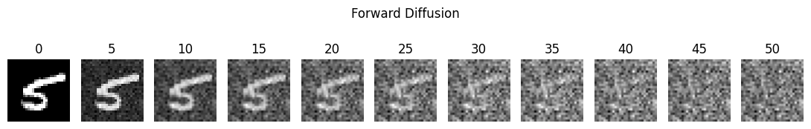
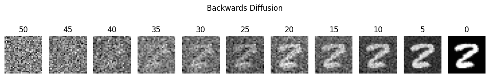

# MNIST Diffusion
---

## 📚 Table of Contents

- [Overview](#overview)
- [Diffusion Process](#diffusion-process)
  - [Forward](#forward-diffusion-process)
  - [Backward](#backward-diffusion-process)
- [Setup Instructions](#setup-instructions)
- [How It Works](#how-it-works)

---

## 💡 Overview

This repository contains a simple implementation of a diffusion model on the MNIST dataset using Pytorch. It includes both the forward and reverse diffusion processes and visualizations to help understand how these models work.

---

## 🌀 Diffusion Process

Below are visualizations of the forward and backward diffusion steps:

| Forward Diffusion Process                        | Backward Diffusion Process                          |
| :----------------------------------------------: | :-------------------------------------------------: |
|  |  |

---

## ⚙️ Setup Instructions

To run the code for yourself:

1. Clone the repository  
    ```bash
    git clone https://github.com/Killerz1243/MNIST-Diffusion.git
    cd MNIST-Diffusion
    ```

2. Create a virtual environment
    ```bash
    python3.10 -m venv venv
    source venv\Scripts\activate  # On Linux: venv/bin/activate
    ```

3. Install dependencies
    ```bash
    pip install -r requirements.txt
    ```

4. Launch the notebook
    ```bash
    jupyter notebook
    ```

---

## 🔍 How It Works
This project implements the denoising diffusion probabilistic model (DDPM) using a Denoising UNet on MNIST.

- The forward process gradually adds Gaussian noise to an image over a series of 50 steps.

- The backward process (learned by a neural network) reverses this noise, generating realistic images from pure noise.

This is inspired by the work of Ho et al. in their [DDPM paper](https://arxiv.org/abs/2006.11239).

--- 

## ❤️ Aknowledgements
Hung-yi Lee the goat for his simple to understand [playlist](https://www.youtube.com/playlist?list=PLJV_el3uVTsNi7PgekEUFsyVllAJXRsP-) on explaining the math behind Diffusion models.

## Whats next?
I'm planning on scaling this model up to work on real world images (like CIFAR-10), and utilizing a pretrained CLIP model to guide the generation based on text descriptions.